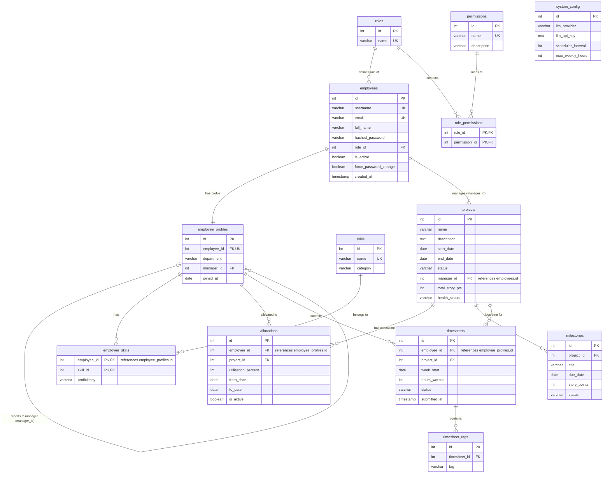
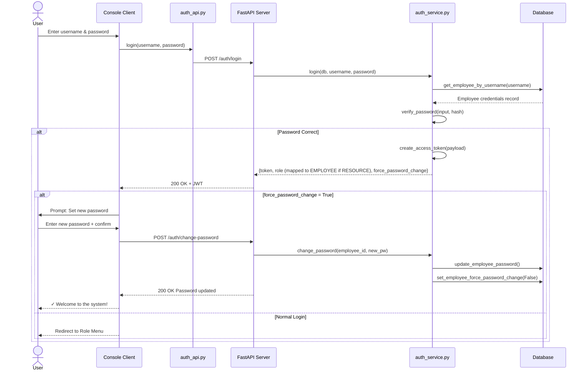
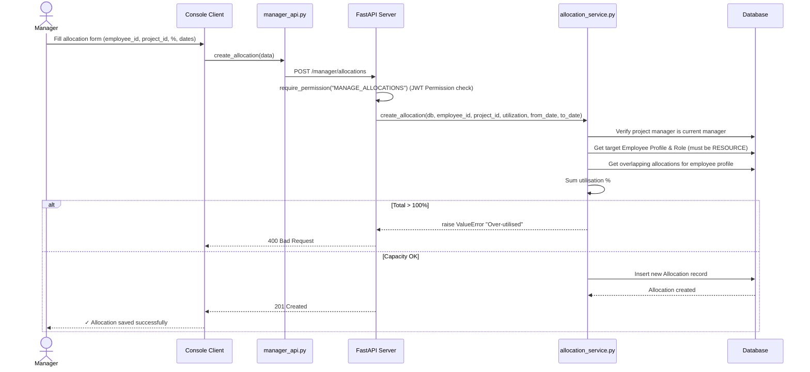
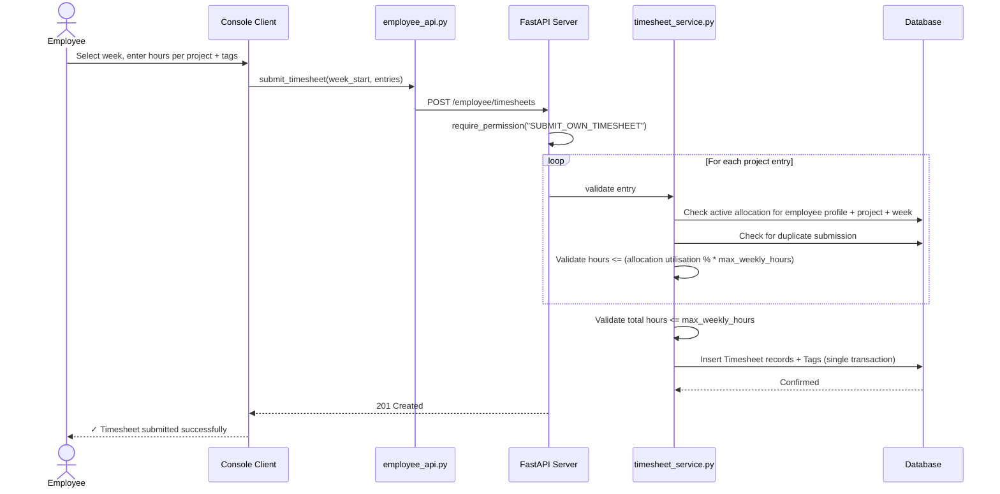

# PRM Tool — System Diagrams

Complete visual representation of the Project & Resource Management Tool architecture, data model, workflows, and user interactions.

---

## 1. Use Case Diagram

```mermaid
flowchart LR
    %% ── Actors (left column) ─────────────────────────────────
    Admin(["Admin"])
    Manager(["Manager"])
    Employee(["Employee (Resource)"])
    Scheduler(["Scheduler"])

    %% ── Shared auth use cases (centre-top) ──────────────────
    subgraph AUTH ["Authentication (All Roles)"]
        direction TB
        UC1(["Login with Credentials"])
        UC2(["Change Password"])
    end

    %% ── Admin use cases ─────────────────────────────────────
    subgraph ADMIN_UC ["Admin Functions"]
        direction TB
        subgraph UMgmt ["User & Employee Management"]
            direction TB
            UC3(["Create Employee Account & Profile"])
            UC4(["Reset Credentials Password"])
            UC5(["Deactivate Employee Account & Profile"])
            UC6(["Assign Manager to Profile"])
            UC7(["Manage Profile Skills"])
        end
        subgraph PMgmt ["Project Management"]
            direction TB
            UC8(["Create / Update Project"])
            UC9(["Add Milestone to Project"])
            UC10(["View All Allocations"])
        end
        UC11(["Configure System Settings"])
    end

    %% ── Manager use cases ────────────────────────────────────
    subgraph MANAGER_UC ["Manager Functions"]
        direction TB
        subgraph ResourceMgmt ["Resource Management"]
            direction TB
            UC12(["View Resource Dashboard"])
            UC13(["Allocate Resource to Project"])
            UC14(["Terminate Allocation"])
        end
        subgraph ProjectMgmt ["Project Monitoring"]
            direction TB
            UC15(["View My Projects & Health"])
            UC16(["View Team Timesheets"])
        end
        subgraph AI ["AI Features"]
            direction TB
            UC17(["AI Skill Match Query"])
            UC18(["AI Project Risk Summary"])
        end
    end

    %% ── Employee use cases ───────────────────────────────────
    subgraph EMPLOYEE_UC ["Employee Functions"]
        direction TB
        UC19(["View My Allocations"])
        UC20(["Submit Weekly Timesheet"])
        UC21(["View Timesheet History"])
        UC22(["Check Missed Weeks"])
    end

    %% ── Automated use cases ──────────────────────────────────
    subgraph AUTO_UC ["Automated Tasks"]
        direction TB
        UC23(["Mark Missed Timesheets"])
        UC24(["Recompute Project Health"])
    end

    %% ── Actor connections ────────────────────────────────────
    Admin     --> UC1
    Admin     --> UC2
    Admin     --> UC3
    Admin     --> UC4
    Admin     --> UC5
    Admin     --> UC6
    Admin     --> UC7
    Admin     --> UC8
    Admin     --> UC9
    Admin     --> UC10
    Admin     --> UC11

    Manager   --> UC1
    Manager   --> UC2
    Manager   --> UC12
    Manager   --> UC13
    Manager   --> UC14
    Manager   --> UC15
    Manager   --> UC16
    Manager   --> UC17
    Manager   --> UC18

    Employee  --> UC1
    Employee  --> UC2
    Employee  --> UC19
    Employee  --> UC20
    Employee  --> UC21
    Employee  --> UC22

    Scheduler --> UC23
    Scheduler --> UC24
```

---

## 2. Entity-Relationship (ER) Diagram

---

## 3. Class Diagram

```mermaid
classDiagram
    class Employee {
        +int id
        +str username
        +str email
        +str full_name
        +str hashed_password
        +int role_id
        +bool is_active
        +bool force_password_change
        +datetime created_at
    }

    class EmployeeProfile {
        +int id
        +int employee_id
        +str department
        +int manager_id
        +date joined_at
    }

    class Role {
        +int id
        +str name
    }

    class Permission {
        +int id
        +str name
        +str description
    }

    class Project {
        +int id
        +str name
        +str status
        +str health_status
        +int manager_id
    }

    class Allocation {
        +int id
        +int employee_id
        +int project_id
        +int utilisation_percent
        +bool is_active
    }

    class Timesheet {
        +int id
        +int employee_id
        +int project_id
        +date week_start
        +int hours_worked
        +str status
    }

    class Milestone {
        +int id
        +int project_id
        +str title
        +date due_date
        +str status
    }

    class AuthService {
        +login(db, username, password) dict
        +change_password(db, employee_id, new_pw) void
    }

    class EmployeeService {
        +create_employee(db, full_name, email, username, temp_pw, role) Employee
        +reset_employee_password(db, employee_id, temp_pw) void
        +deactivate_employee_account(db, employee_id) void
        +reactivate_employee_account(db, employee_id) void
        +get_all_employees(db, filters) list
        +get_employee_detail(db, profile_id) dict
        +deactivate_employee(db, profile_id) void
    }

    class ProjectService {
        +create_project(db, data) Project
        +update_project(db, project_id, updates) Project
        +get_all_projects(db) list
        +get_project_milestones(db, project_id) dict
    }

    class AllocationService {
        +create_allocation(db, emp_id, proj_id, utilization, from_date, to_date) Allocation
        +end_allocation(db, alloc_id, manager_id) void
    }

    class TimesheetService {
        +submit_timesheet(db, emp_id, week_start, entries) void
        +get_timesheet_history(db, emp_id) list
        +get_missed_weeks(db, emp_id) list
    }

    Employee "1" -- "1" EmployeeProfile : has
    EmployeeProfile "many" --> "0..1" EmployeeProfile : reports to manager_id
    Employee "many" --> "1" Role : associated with
    Role "many" -- "many" Permission : contains
    EmployeeProfile "1" --> "many" Allocation : active in
    Project "1" --> "many" Allocation : has
    Project "1" --> "many" Milestone : contains
    EmployeeProfile "1" --> "many" Timesheet : submits
```

---

## 4. Sequence Diagrams

### 4a. Authentication & Forced Password Change

---

### 4b. Resource Allocation with Capacity Check

---

### 4c. Timesheet Submission with Cap Validation

