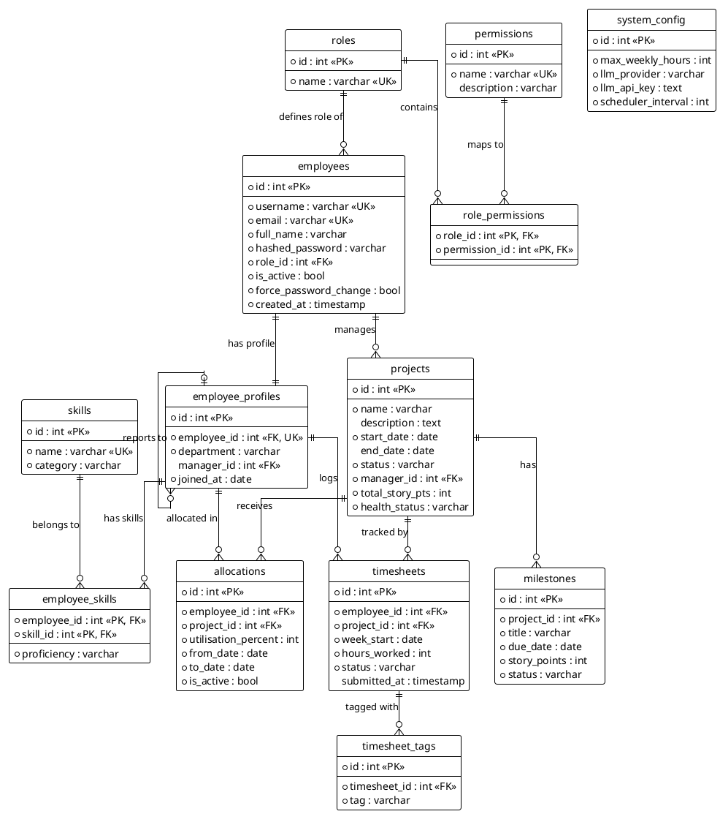
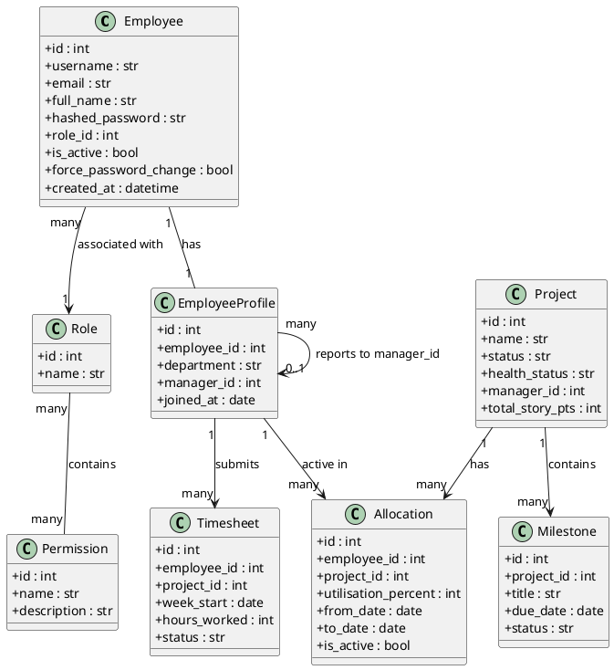

# PRM Tool — PlantUML System Diagrams

This document contains the complete visual representation of the PRM Tool architecture, data models, workflows, and user interactions in **PlantUML** format.

---

## 1. Use Case Diagram

```plantuml
@startuml PRM_UseCaseDiagram

skinparam actorStyle awesome
skinparam defaultTextAlignment center
skinparam usecase {
    BackgroundColor #EEF3FF
    BorderColor     #3B4DB8
    ArrowColor      #3B4DB8
    FontSize        12
}
skinparam actor {
    BackgroundColor #FAFAFA
    BorderColor     #3B4DB8
    FontSize        12
    FontStyle       bold
}
skinparam package {
    BackgroundColor #F7F9FF
    BorderColor     #9099CC
    FontSize        11
    FontStyle       bold
}

actor "Admin"          as A
actor "Manager"        as M
actor "Employee"       as E
actor ":Scheduler\n(System Clock)" as S

rectangle "PRM Tool — Project & Resource Management System" {

    package "Authentication" <<Rectangle>> {
        usecase "Login"                       as UC_Login
        usecase "Validate Credentials"       as UC_ValidateCreds
        usecase "Change Password"             as UC_ChangePwd
        usecase "Validate Password Strength" as UC_ValidatePwdStr
    }

    package "User & Employee Management" <<Rectangle>> {
        usecase "Create Employee Account & Profile" as UC_CreateUser
        usecase "Reset Credentials Password"     as UC_ResetPwd
        usecase "Deactivate Employee Account"    as UC_Deactivate
        usecase "Assign Manager to Profile"      as UC_AssignMgr
        usecase "Manage Employee Skills"          as UC_ManageSkills
    }

    package "Project Administration" <<Rectangle>> {
        usecase "Create / Update Project"         as UC_ManageProject
        usecase "Add Milestone to Project"        as UC_AddMilestone
        usecase "View All Allocations"            as UC_ViewAllAlloc
    }

    usecase "Configure System Settings"           as UC_ConfigSystem

    package "Resource Management" <<Rectangle>> {
        usecase "View Resource Dashboard"         as UC_Dashboard
        usecase "Allocate Resource to Project"    as UC_Allocate
        usecase "Validate Capacity (100% cap)"   as UC_ValidateCap
        usecase "Terminate Allocation"            as UC_TerminateAlloc
    }

    package "Project Monitoring" <<Rectangle>> {
        usecase "View Projects & Health Status"   as UC_ViewProjects
        usecase "View Team Timesheets"            as UC_ViewTeamTS
    }

    package "AI-Assisted Features" <<Rectangle>> {
        usecase "AI Skill Match Query"            as UC_SkillMatch
        usecase "AI Project Risk Summary"         as UC_RiskSummary
        usecase "Filter by Free Capacity"         as UC_FilterCap
        usecase "Collect Risk Flags"              as UC_CollectFlags
    }

    package "Timesheet Management" <<Rectangle>> {
        usecase "Submit Weekly Timesheet"         as UC_SubmitTS
        usecase "Validate Timesheet Entry"        as UC_ValidateEntry
        usecase "Check Not Future Week"           as UC_FutureWeek
        usecase "Check Active Allocation"         as UC_CheckAlloc
        usecase "Check Hours Cap"                 as UC_HoursCap
        usecase "Prevent Duplicate Submission"    as UC_NoDuplicate
        usecase "View Timesheet History"          as UC_TSHistory
        usecase "Check Missed Weeks"              as UC_MissedWeeks
    }

    usecase "View My Allocations"                 as UC_ViewMyAlloc

    package "Background Scheduled Jobs" <<Rectangle>> {
        usecase "Flag Missed Timesheets"          as UC_FlagMissed
        usecase "Update Project Health Status"    as UC_UpdateHealth
        usecase "Recompute Employee Status"       as UC_RecomputeStatus
    }
}

A --> UC_Login
A --> UC_ChangePwd
A --> UC_CreateUser
A --> UC_ResetPwd
A --> UC_Deactivate
A --> UC_AssignMgr
A --> UC_ManageSkills
A --> UC_ManageProject
A --> UC_AddMilestone
A --> UC_ViewAllAlloc
A --> UC_ConfigSystem

M --> UC_Login
M --> UC_ChangePwd
M --> UC_Dashboard
M --> UC_Allocate
M --> UC_TerminateAlloc
M --> UC_ViewProjects
M --> UC_ViewTeamTS
M --> UC_SkillMatch
M --> UC_RiskSummary

E --> UC_Login
E --> UC_ChangePwd
E --> UC_SubmitTS
E --> UC_TSHistory
E --> UC_MissedWeeks
E --> UC_ViewMyAlloc

S --> UC_FlagMissed
S --> UC_UpdateHealth
S --> UC_RecomputeStatus

UC_Login      ..>  UC_ValidateCreds     : <<include>>
UC_ChangePwd  ..>  UC_ValidatePwdStr    : <<include>>
UC_ResetPwd   ..>  UC_ValidatePwdStr    : <<include>>
UC_CreateUser ..>  UC_ValidatePwdStr    : <<include>>
UC_Allocate   ..>  UC_ValidateCap       : <<include>>
UC_SubmitTS   ..>  UC_ValidateEntry     : <<include>>
UC_ValidateEntry ..> UC_FutureWeek      : <<include>>
UC_ValidateEntry ..> UC_CheckAlloc      : <<include>>
UC_ValidateEntry ..> UC_HoursCap        : <<include>>
UC_ValidateEntry ..> UC_NoDuplicate     : <<include>>
UC_SkillMatch ..>  UC_FilterCap         : <<include>>
UC_RiskSummary ..> UC_CollectFlags      : <<include>>

UC_ChangePwd  ..>  UC_Login             : <<extend>>\n{condition: force_password_change = True}
M -up-|> A : generalizes

@enduml
```

---

## 2. Entity-Relationship (ER) Diagram

---

## 3. Class Diagram

